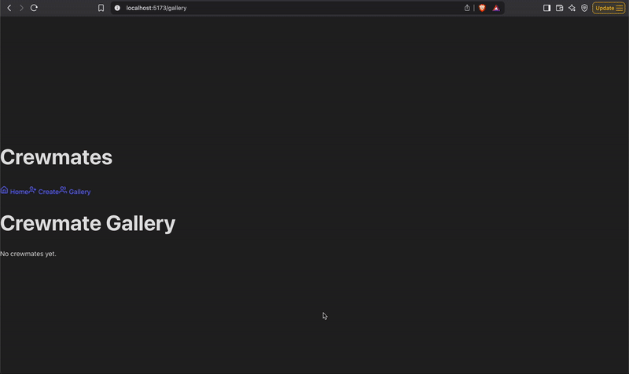

# Crewmates React App

Web application inspired by *Among Us*, allowing users to create, view, edit, and delete crewmates. Each crewmate has a name, color, and speed. The app includes a form to add new crewmates, a summary dashboard to view them, and detailed views with full CRUD functionality.

---

## ✅ Required Features

- [x] The web app contains a page that features a create form to add a new crewmate  
- [x] Users can name the crewmate  
- [x] Users can set the crewmate’s attributes by clicking on one of several values  
- [x] The web app includes a summary page of all the user’s added crewmates  
- [x] The summary page is sorted by creation date such that the most recently created crewmates appear at the top  
- [x] A previously created crewmate can be updated from the list of crewmates in the summary page  
- [x] Each crewmate has an edit button that will take users to an update form for the relevant crewmate  
- [x] Users can see the current attributes of their crewmate on the update form  
- [x] After editing the crewmate's attribute values using the form, the user can immediately see those changes reflected in the update form and on the summary page  
- [x] A previously created crewmate can be deleted from the crewmate list  
- [x] Using the edit form detailed in the previous feature, there is a button that allows users to delete that crewmate  
- [x] After deleting a crewmate, the crewmate should no longer be visible in the summary page  
- [x] Each crewmate has a direct, unique URL link to an info page about them  
- [x] Clicking on a crewmate in the summary page navigates to a detail page for that crewmate  
- [x] The detail page contains extra information about the crewmate not included in the summary page  
- [x] Users can navigate to the edit form from the detail page  

---

## 🎥 Demo

